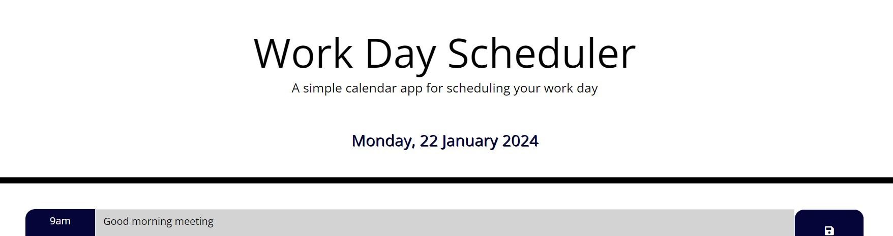
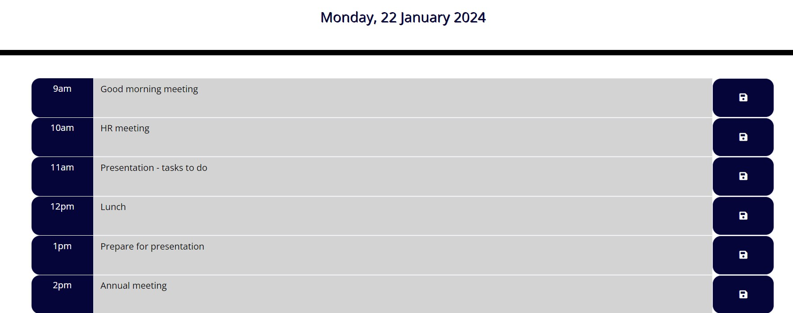

# Work-Day-Scheduler

A simple day scheduler application that allows a user to save events for each hour of the day.

## Description

This project displays the current day and date at the top of the page and helps the user plan their work day per hour.

## Instalation

The website page can be accessed [here](https://ionescuea.github.io/Work-Day-Scheduler/).

## Usage

The main page displays a current Work Day Scheduler, as showed on the top page.

The user can plan their current work-day, per hour, and use the save button at the end of the each row to save, on the browser's local storage, the tasks that need to be done. If saved, the tasks inputted on the page are not lost on the reload page.

Also, for an easier usage, the timeblocks are color-coded based on past (grey), present (red), and future (green) activities.

## Credits

[BootcampSpot](https://github.com/edx)

[Alexandra Ionescu](https://github.com/ionescuea)

## License

Licensed under the [MIT](LICENSE) license.
